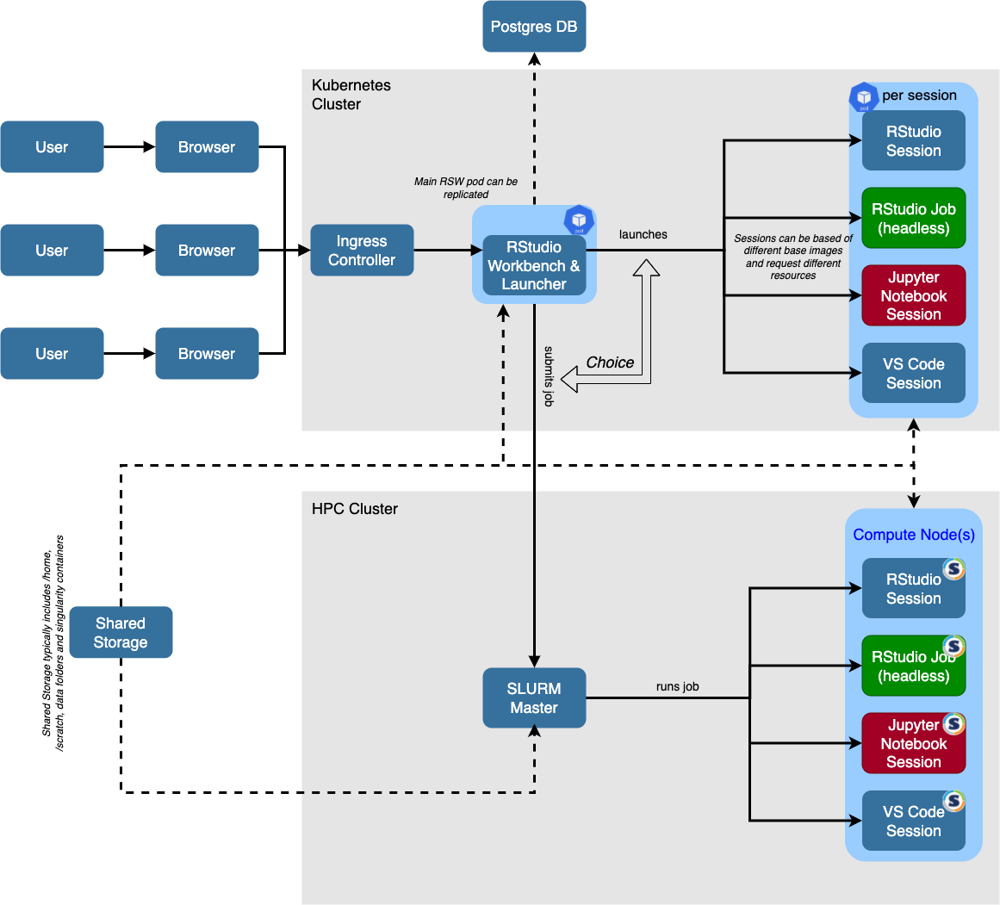

# Please note that Posit has released [Enterprise grade support for Singularity in Workbench](https://docs.posit.co/ide/server-pro/job_launcher/slurm_plugin.html#slurm-rsp-singularity). For more comprehensive documentation please refer to the [contributed docs](https://pub.current.posit.team/public/singularity/)


# Introduction

[Apptainer (formerly known as Singularity)](https://apptainer.org/) is a tool very specific to HPC. It allows the execution of docker containers in user space. This alleviates the concern of granting admin privileges to end users on a shared file system. 

Singularity also comes with its own language to build a singularity container that is reasonably similar to what docker uses. 

Singularity can either run singularity containers or docker containers. The latter it transforms into singularity on-the-fly. 

The goal of this article is to 

* inform the installation and configuration of singularity on a HPC cluster running [SLURM](https://slurm.schedmd.com/) as a scheduler
* Configure [R Studio Workbench (RSW)](https://www.rstudio.com/products/workbench/) to use singularity containers on the same HPC

# Target Architecture


* Everything related to RStudio Workbench and R runs in containers (docker and singularity)
* Look&feel of RStudio Workbench (almost) unchanged from a user perspective
* Utilisation of shared storage for singularity containers and `renv` cache

# High-level Overview of the steps 

1. Installation of Singularity
2. Setup a [SPANK](https://slurm.schedmd.com/spank.html) plugin for deep integration of singularity into SLURM
3. Build Singularity Containers for R Session based on the docker containers for [r-session-complete](https://hub.docker.com/r/rstudio/r-session-complete)
4. Build Docker Container for RSW based on [rstudio-workbench](https://hub.docker.com/r/rstudio/rstudio-workbench)
5. Simple tests for the new functionality
6. Hints and suggestions on how to use Singularity and R for increased reproducibility

# Assumptions/Requirements

* reasonably up-to-date vand fully functional version of SLURM (Version 19+)
* (optional) application stack using [environment modules ](https://modules.readthedocs.io/en/latest/) or [Lmod](https://lmod.readthedocs.io/en/latest/) with base directory in `appstack-path`
* persistent shared storage across the nodes (e.g. general NAS, NFS, GPFS, ...) to store the singularity images. Folder name will subsequently referred to as `container-path`
* transient shared storage across the nodes (e.g. Lustre, GPFS, ...) for scratch storage, subsequently referred to as `scratch-path`
* Using a docker container for RSW is not strictly needed - RSW can also be installed and configured natively

# Installation of Singularity

For the installation simply follow along the [instructions](https://apptainer.org/admin-docs/master/installation.html#installation-on-linux). 

If you plan to integrate it into your application stack, make sure you choose a `prefix` that is compatible with your other applications in the stack and uses the same naming convention, e.g. `appstack-path/singularity/3.8.5` for Singularity 3.8.5. A [sample Lua Module](data/3.8.5.lua) is provided for conveniency.

# SPANK Plugin for Singularity
 
## Introduction

[SLURM](https://slurm.schedmd.com/) is a popular HPC scheduler that supports [SPANK](https://slurm.schedmd.com/spank.html) plugins. SPANK stands for **S**lurm **P**lug-in **A**rchitecture for **N**ode and job **K**ontrol. For the work considered here a new SPANK plugin is created that that will allow a deep integration of singularity into the HPC. 

While strictly not necessary, it will simplify the usage of singularity significantly for the end users. 

## Integration motivation & general idea

Instead of using a submit script for each singularity run like 

```
#!/bin/bash

singularity run R-container.sif Rscript myCode.R
```

they can run straight

```
#!/path/to/Rscript 
#SBATCH --singularity-container my-R-container.sif

<R Code> 
```

i.e. add the SBATCH line above and other resource requirements to their R Code and submit this without the need of knowing all the details of the singularity implementation (`/path/to/Rscript` needs to resemble the path within the container.

## Setup and configuration of SPANK plugin

RStudio is not the first company that uses SPANK plugin for singularity integration. Many other Supercomputing Centers around the world have implemented such a plugin. 

We are therefore using an implementation from [GSI](https://github.com/GSI-HPC/slurm-singularity-exec/) that we extended further to make it even more flexible.  

Further details with up-to-date information can be found in [slurm-singularity-exec](slurm-singularity-exec
).

In order to install and configure the SPANK plugin for singularity specifically for our use case, please use the plugin in the subfolder [slurm-singularity-exec](slurm-singularity-exec). 

For a typical AWS ParallelCluster installation you simply would run 

```
cmake -S . -B build -DCMAKE_INSTALL_PREFIX=/opt/slurm \
    -DINSTALL_PLUGSTACK_CONF=ON \
    -DCMAKE_INSTALL_LIBEXECDIR=/opt/slurm/libexec
cmake --build build --target install 
```

Once the plugin is installed, please restart `slurmctld` via 

```
systemctl restart slurmctld
```
  
## Basic testing of new plugin

First let us build a singularity image from a docker container, e.g. from CentOS 8: 

```
singularity build centos8.img docker://centos:8
```

We now can run this command via singularity

```
singularity run centos8.img cat /etc/centos-release
```

which should show us that we are indeed running in CentOS 8.

To test the SPANK Plugin for singularity now we can run 

```
srun --pty --singularity-container /path/to/centos8.img bash
Singularity> cat /etc/centos-release
```
If the above steps work, then the plugin is good to go for the next step. 

# Build Singularity Containers for R Session 

## General design principle

* reuse as much as possible, that is why we will use containers from [r-session-complete](https://hub.docker.com/r/rstudio/r-session-complete)
* only add as much as needed but also enough to make the use of the containers straightforward and seamless
* add some packages and configuration specific for HPC (e.g munge, zeromq as a pre-req for clustermq) 
* add renv to avoid the chicken-and-egg problem, i.e. to have renv installed in addition to all the other Base R packages
* configure renv to use a global package cache and add OS/linux-distro specific additional level in the directory structure
* add Java integration to the installed version of R since `rJava` is a problematic R package 
* setup binary repositories for CRAN and BioConductor from public RSPM
* for CentOS 7 add [devtoolset-10](https://access.redhat.com/documentation/en-us/red_hat_developer_toolset/10/html-single/user_guide/index) to allow for more recent compiler toolchain. 
* for RockyLinux8 and 9 add [gcc-toolset-13](https://access.redhat.com/documentation/en-us/red_hat_enterprise_linux/8/html/developing_c_and_cpp_applications_in_rhel_8/additional-toolsets-for-development_developing-applications#tools-and-versions-provided-by-gcc-toolset-13_gcc-toolset-13) to allow a more recent compiler toolchain, too
* Install SLURM binaries into the container to prevent any linux distribution dependency on the distribution used on the HPC cluster
* Install all R packages needed for the RStudio IDE integration into a site library

## Singularity recipe

Appropriate singularity recipes can be found for 

* [CentOS 7](data/r-session-complete/centos7) 
* [Rocky Linux 8](data/r-session-complete/rockylinux8)
* [Rocky Linux 9](data/r-session-complete/rockylinux9)
* [RHEL 8](data/r-session-complete/rhel8)
* [RHEL 9](data/r-session-complete/rhel9)
* [Ubuntu 20.04 LTS (Focal)](data/r-session-complete/focal)
* [Ubuntu 22.04 LTS (Jammy)](data/r-session-complete/jammy)
* [Ubuntu 24.04 LTS (Noble)](data/r-session-complete/noble).
 
They have ample comments to help you decide which bits to keep and which to discard. 

They can be built by using the following process

First, you will need to define various parameters for the container. A [sample file](data/r-session-complete/build.env) can be used to get started. While the parameters should be mostly self-explanatory, here is a summary of each 

* `PRO_DRIVERS_VERSION` - version of [Posit Professional Drivers](https://docs.posit.co/pro-drivers/workbench-connect/)
* `QUARTO_VERSION` - version of [Quarto](https://quarto.org/docs/get-started/) 
* `R_VERSION_LIST` and `R_VERSION_DEFAULT` - list of R versions and the system default R version 
* `PYTHON_VERSION_LIST` and `PYTHON_VERSION_DEFAULT` - list of Python versions and the system default Python version 
* `PWB_VERSION` - [Posit Workbench](https://docs.posit.co/ide/server-pro/getting_started/installation/installation.html) Version. Please note that we are using the version names as specified at https://dailies.rstudio.com/release/. Also please replace any "+" with "-". 
* `SLURM_VERSION` - Version of [Slurm](https://www.schedmd.com/downloads.php)
* `APPTAINER_VERSION` - Version of [Apptainer](https://github.com/apptainer/apptainer/releases)


```
singularity build --build-arg-file ../build.env containers.sif r-session-complete.sdef
```

Please note that this can be a very time-consuming process. Ensure that your temporary folder (e.g. `/tmp` or wherever the environment variable `TMP`/`TMPDIR` etc. points to) has sufficient amounts of disk space available. You will definitely need around 4 GB of disk space. A benefit of singularity containers is that they are much smaller (<50 % of docker image size) but they take a while to build.

Also make sure you set the 'SLURM_VERSION' variable to the same version  than your HPC cluster is using. 

If you intend to submit jobs from within the Singularity Container, please make sure to point the environment variable `SLURM_CONF` to the location of `slurm.conf` on the HPC cluster in `launcher-env`. For AWS ParallelCluster one would set `SLURM_CONF=/opt/slurm/etc/slurm.conf`. 

For the RHEL 8 and 9 images - you will find a script `rhn.sh` in the `scripts` subfolder - please put your RHN credentials there so the docker build process can make use of the RHEL packages. While the containers are bootstrapped from the free UBI images, some packages are not available in the UBI repo and hence a registration against Red Hat Network is necessary. 

## Dockerfiles

While singularity recipes as detailed in the previous section are using the native apptainer/singularity software, the absence of layering in singularity/apptainer can make development of singularity containers very tedious. Assume you are working on a singularity/apptainer container but the build fails after 80 % of the build time. You now have to fix the error and rebuild the container. Singularity/Apptainer will start from scratch again. 

With dockerfiles and Docker containers, due to the use of layers, a rebuild of the container will always re-use layers that have successfully been built already from the docker build cache. This significantly speeds up the development time. Once your docker container is fully functional, you then can convert the same into a singularity image on-the-fly. 

Only disadvantage of this approach is that you may need to create a docker registry unless you already have access to one. 

### Docker registry

Create your own little provate docker registry via 

```
docker run -p 5000:5000 -d registry:2
```

and then tag and push your containers like 

```
docker tag r-session-complete-hpc:rockylinux9-pwb-2023.09.1-494.pro2-slurm-23.02.6 localhost:5000/r-session-complete-hpc:rockylinux9-pwb-2023.09.1-494.pro2-slurm-23.02.6
docker push localhost:5000/r-session-complete-hpc:rockylinux9-pwb-2023.09.1-494.pro2-slurm-23.02.6
```

Once the container is in the registry, you can directly convert it into an apptainer/singularity container via 

```
SINGULARITY_NOHTTPS=1 singularity build r-session-complete-hpc-rockylinux9-pwb-2023.09.1-494.pro2-slurm-23.02.6.sif docker://localhost:5000/r-session-complete-hpc:rockylinux9-pwb-2023.09.1-494.pro2-slurm-23.02.6 
```

# Docker container for RSW

## Default values

It is mandatory to set the environment variable `RSW_LICENSE` to point to a valid license key. In addition, the docker container will be built for SLURM 19.05.2 and RStudio Workbench 2021.09.1-372.pro1 by default. Those defaults can be changed by defining the environment variables `SLURM_VERSION` and `RSW_VERSION`, respectively.   

## Preparation 

* Change into the directory [`data/workbench`](data/workbench) of this repository
* Make sure the `launcher-sessions-callback-address` in `etc/rstudio/rserver.conf` is set to an URL that is reachable from the compute nodes.
* Create a directory `munge` and copy your munge.key into that folder. Change ownership to user and group 111 (e.g. `chown 111:111 munge/munge.key`). 
* Run (using admin privileges)

```bash
docker-compose build
```

* You also may want to 
    * push the new image to your docker registry
    * configure your authentication mechanism in the docker container
    * review in docker-compose.yml the bind mounts (e.g. /efs) to ensure that essential file systems (/home, ...) are mounted into the cntainer. 

## Running the docker container

```bash
docker-compose up -d 
```

## Simple smoke test

1. Browsing to `http://<hostname of docker server>:8787` should now present the RSW login screen. (by default it has two users, `rstudio/rstudio` and `mm/test123`)
2. Once logged in you then can select between local and SLURM launcher and run your R session.  


## Where are the singularity specifics ? 

The singularity integration of the RSW ui is done in [`launcher.slurm.conf`](data/workbench/etc/launcher.slurm.conf). There you will find the line

```bash
constraints=Container=singularity-container
```

which will activate a new element in the web UI where users can specify the respectivee image they want to load. The slurm launcher will then appen the option `--singularity-container` with the value specified in this field to the sbatch command that will spawn the session. 

Thanks to setting up good defaults in the SPANK plugin (`--singularity-container-path|path`, `--singularity-bind|bind`) the user only needs to worry about the container name - even that is then being cached once typed in. 

# Appendix

## Known issues

* With the current implementation, the slurm launcher will produce warning messages "Failed to get job metadata". This is due to the implementation of the launcher that expects the job metadata at the start of the slurm standard output file. With the SPANK plugin however the first line in standard output is "Start singularity container...". Customers that would like to get rid of this messages, need to comment out line 43 of [`slurm-singularity-wrapper.sh`](slurm-singularity-exec/slurm-singularity-wrapper.sh)
* Start time of the Singularity R Sessions can be a little bit longer compared to native sessions. This is mostly due to the load time of the singularity container. 

## renv on an HPC cluster

### A primer on renv

[renv](https://rstudio.github.io/renv/articles/renv.html) is a R package that is used for R package management. It enables the reproducible usage of R packages. 

### Dealing with renv in a version controlled workflow 

renv maintains a project specific `renv.lock` file where all the metadata (packages, versions, repository information) is stored. When using a version-controlled workflow, this file needs to be stored in the source code repository. Any other file or directory (e.g. renv subfolder) can be considered transient and does not need to be added to version control.

In the case of using `git` it is advisable to create file `.gitignore` in the root folder of the project and add the line 
```bash
renv
```
into that file. 

### What does renv actually do ? 

#### Initialisation of a project for renv

`renv::init()` will initialize a project for the use of renv. It will check the R code files in the current directory and detect any needed package, check the renv cache if the package is there in the version it can download it from the defined repositories. If it is not there, it will install the same into the local subfolder (`renv`). With the exception of renv package itself any R package will then be moved to a cache and a symbolic link created to its original location. If the package is already in the cache in the requested version, a simple symlink will be created. 

The advantage of this is that once a R package is in the cache,  subsequent installations of commonly used R packages will be much faster 

#### renv package cache

By default the package cache is created in each user's home-directory (`~/.local/share/renv`). This can be changed by defining `RENV_PATHS_CACHE` in `Renviron.site` of the R installation. The variable should point to a common folder with appropriate write permissions for everyone. 

On systems where there is the use of multiple operating systems and linux distributions, setting 
```bash
RENV_PATHS_PREFIX_AUTO = TRUE
```
can be useful - the cache directory structure will then contain an extra directory level named according to the OS used. 

For `r-session-complete` we set 

```bash
RENV_PATHS_PREFIX_AUTO = TRUE
RENV_PATHS_CACHE=/scratch/renv
RENV_PATHS_SANDBOX=/scratch/renv/sandbox
```

to create a global package cache shared by users and across nodes.

If you want to use such a functionality, please make sure you are setting the appropriate ACL's and ensure that those are replicated further downstream

A very open ACL for the packge cache would be 

```bash
# file: scratch/renv/
# owner: root
# group: root
user::rwx
group::rwx
mask::rwx
other::rwx
default:user::rwx
default:group::rwx
default:mask::rwx
default:other::rwx
```


#### Restoring an R environment when using an existing code

If you would like to run the code of a colleague that uses `renv` in his work, you need to run `renv::restore()` in the root-folder of the project. This command will setup the environment and retrieve all the R packages as defined in `renv.lock`

#### Keeping the R environment up-to-date 

During the code development, new packages will be needed. In order to stay in sync with the renv.lock file, it is advisable to run `renv::snapshot()` from time to time and check-in the changes in `renv.lock` together with the code commits. 

#### Speeding up renv 

`renv` and package installation in general can be sped up using binary packages, either served from CRAN or from [RStudio Package Manager](https://packagemanager.rstudio.com/). 

As of `renv` 0.15.1, parallel installation of R packages is supported via the uise of `pak`. This can be activated by setting 

```
options(renv.config.pak.enabled = TRUE)
```

## Unified architecture with Docker/Kubernetes and Singularity/HPC




